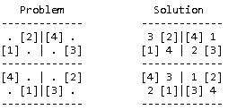
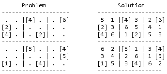
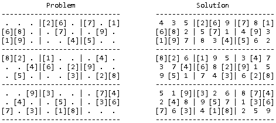
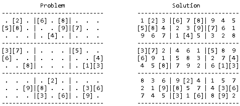
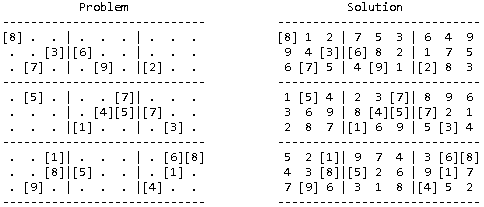

# Sudoku Solver

A command-line Sudoku solver written in Java that works for any rectangular grid size — not just the standard 9×9.

The focus of this project was the solving algorithm itself: constraint propagation combined with backtracking and a most-constrained-variable heuristic. No GUI, just clean terminal output showing the problem and solution side by side.

## How it works

The solver uses two techniques together:

1. **Constraint propagation** — repeatedly eliminates impossible values from each cell based on what's already placed in its row, column, and box. This alone solves most easy puzzles.
2. **Backtracking** — when propagation gets stuck, the solver picks the cell with the fewest remaining candidates, makes a guess, and backtracks if it leads to a contradiction.

## Grid sizes

`sizeX` and `sizeY` define the dimensions of the **small rectangle**, not the full grid. The full grid is always `(sizeX × sizeY)` cells wide and tall.

| sizeX | sizeY | Full grid |
|-------|-------|-----------|
| 2 | 2 | 4×4 |
| 3 | 2 | 6×6 |
| 3 | 3 | 9×9 (standard) |

## Running it

No build tools required. Compile and run with:

```bash
javac -d bin src/sudoku/*.java
java -cp bin sudoku.Main
```

Puzzles are hardcoded in `Main.java`. Change the `difficulty` variable to switch between the included examples (0 = Easy, 1 = Intermediate, 2 = Difficult, 3 = Insane).

## Examples

### Easy — 2×2 grid (4×4)



---

### Easy — 3×2 grid (6×6)



---

### Easy — 3×3 grid (9×9)



---

### Intermediate — 3×3 grid (9×9)



---

### "The Hardest" — 3×3 grid (9×9)

Created in 2012 by Finnish mathematician Arto Inkala, [widely considered](https://www.conceptispuzzles.com/index.aspx?uri=info/article/424) one of the hardest Sudoku puzzles ever designed.

Solved in **0.712s**.



---

## License

[MIT](https://github.com/LeafarCoder/Sudoku-Solver/blob/master/LICENSE) — Rafael Correia
